# Account Management Platform - Multi-Agent Architecture
> **Framework Version**: 2.0.0 | **Agent Protocol**: Anthropic Multi-Agent Research Pattern
> **Services Covered**: 16 IT Services | **Users Managed**: 245+ | **Departments**: 18

## 🎯 Agent Hierarchy Overview

```mermaid
graph TD
    MO[Master Orchestrator] --> SO[Service Orchestrator]
    MO --> CO[Core Operations]
    MO --> QA[Quality Assurance]
    
    SO --> SA1[IPAM Agent]
    SO --> SA2[Grafana Agent]
    SO --> SA3[Teleport Agent]
    SO --> SA4[RADIUS Agent]
    SO --> SA5[Unifi Agent]
    SO --> SA6[Zabbix Agent]
    SO --> SA7[Eight Sight Agent]
    SO --> SA8[Kibana Agent]
    SO --> SA9[ITop Agent]
    SO --> SA10[NetEco Agents]
    SO --> SA11[NCE-FAN ATP Agent]
    SO --> SA12[eSight Agent]
    SO --> SA13[Mikrotik VPN Agent]
    SO --> SA14[FortiGate VPN Agent]
    SO --> SA15[NOC Services Agent]
    SO --> SA16[Biometrics Agent]
    
    CO --> DB[Database Agent]
    CO --> MG[Migration Agent]
    CO --> AU[Audit Agent]
    
    QA --> BF[Bug Fixer Agent]
    QA --> PO[Performance Agent]
    QA --> SC[Security Agent]
```



---

## 🤖 Master Orchestrator Agent

### Configuration
```yaml
master-orchestrator:
  model: claude-sonnet-4
  context_window: dedicated
  role: "Supreme coordinator for enterprise account management system"
  
  core_responsibilities:
    - Coordinate 16 service-specific sub-agents
    - Manage parallel task execution
    - Resolve inter-service conflicts
    - Maintain data consistency across services
    - Orchestrate bulk operations (245+ users)
    - Handle critical decision escalation
  
  delegation_strategies:
    parallel:
      - Service synchronization across all 16 platforms
      - Bulk user provisioning operations
      - Multi-service status checks
    sequential:
      - User creation → Permission assignment → Service activation → Audit
      - Data migration → Validation → Deployment → Verification
    hierarchical:
      - Master → Service Orchestrator → Individual Service Agents
      - Master → Core Operations → Database/Migration/Audit
  
  success_metrics:
    - 100% service synchronization accuracy
    - <5 second response for bulk operations
    - Zero data inconsistencies
    - 99.9% uptime for critical operations
  
  error_handling:
    - Automatic retry with exponential backoff
    - Failover to backup agents
    - Real-time alert generation
    - Rollback capability for all operations
```

---

## 📡 Service-Specific Agents (16 Total)

### 1. IPAM Agent (IP Address Management)
```yaml
ipam-agent:
  model: claude-haiku-3
  service: "IP Address Management System"
  api_type: "REST API / phpIPAM"
  
  capabilities:
    - IP address allocation and deallocation
    - Subnet permission management
    - VLAN access control
    - DNS record synchronization
    - Network documentation updates
    - IP conflict detection and resolution
  
  api_operations:
    user_sync:
      endpoint: "/api/v1/users"
      method: ["GET", "POST", "PUT", "DELETE"]
    ip_allocation:
      endpoint: "/api/v1/addresses"
      method: ["POST", "DELETE"]
    subnet_permissions:
      endpoint: "/api/v1/subnets/permissions"
      method: ["GET", "PUT"]
  
  data_mapping:
    user_id: "username"
    permissions: "subnet_access_list"
    ip_assignments: "allocated_addresses"
  
  parallel_execution: true
  rate_limit: 100/minute
  timeout: 30s
```

### 2. Grafana Agent (Monitoring Dashboards)
```yaml
grafana-agent:
  model: claude-haiku-3
  service: "Grafana Visualization Platform"
  api_type: "Grafana HTTP API v9.0+"
  documentation: "https://grafana.com/docs/grafana/latest/developers/http_api/"
  
  capabilities:
    - User and team management
    - Dashboard access control
    - Organization management
    - Data source permissions
    - Alert notification channels
    - Folder permissions
    - API key management
  
  api_operations:
    user_management:
      create: "POST /api/users"
      update: "PUT /api/users/:userId"
      delete: "DELETE /api/users/:userId"
      permissions: "PUT /api/users/:userId/permissions"
    
    dashboard_access:
      list: "GET /api/dashboards"
      permissions: "POST /api/dashboards/uid/:uid/permissions"
      folder_access: "POST /api/folders/:uid/permissions"
    
    team_management:
      create: "POST /api/teams"
      add_member: "POST /api/teams/:teamId/members"
      remove_member: "DELETE /api/teams/:teamId/members/:userId"
  
  integration_features:
    - LDAP sync support
    - OAuth integration
    - RBAC implementation
    - Multi-tenancy support
  
  parallel_execution: true
  rate_limit: 50/minute
  retry_strategy: exponential_backoff
```

### 3. Teleport Agent (Secure Access Platform)
```yaml
teleport-agent:
  model: claude-haiku-3
  service: "Teleport Secure Access Platform"
  api_type: "Teleport API v13"
  documentation: "https://goteleport.com/docs/api/"
  
  capabilities:
    - SSH/Kubernetes/Database access control
    - Role-based access policies
    - Session recording configuration
    - Certificate management
    - MFA enforcement
    - Access request workflows
    - Audit log management
  
  api_operations:
    user_provisioning:
      create: "POST /v1/users"
      roles: "PUT /v1/users/:name/roles"
      traits: "PUT /v1/users/:name/traits"
    
    access_control:
      ssh_access: "POST /v1/roles/:name/ssh"
      k8s_access: "POST /v1/roles/:name/kubernetes"
      db_access: "POST /v1/roles/:name/databases"
    
    session_management:
      list: "GET /v1/sessions"
      terminate: "DELETE /v1/sessions/:id"
      playback: "GET /v1/sessions/:id/stream"
  
  security_features:
    - Hardware key support (YubiKey, TouchID)
    - Per-session MFA
    - Just-in-time access requests
    - Privileged access workflows
  
  parallel_execution: true
  connection_pooling: 10
```

### 4. RADIUS Agent (Network Authentication)
```yaml
radius-agent:
  model: claude-haiku-3
  service: "RADIUS Authentication Server"
  api_type: "FreeRADIUS REST API / Direct DB"
  
  capabilities:
    - User authentication management
    - Network access control
    - MAC address authentication
    - VLAN assignment
    - Connection time limits
    - Bandwidth restrictions
    - Guest access management
  
  database_operations:
    tables:
      - radcheck (user credentials)
      - radreply (reply attributes)
      - radusergroup (group membership)
      - radgroupcheck (group policies)
      - radacct (accounting data)
    
    user_operations:
      add_user: "INSERT INTO radcheck (username, attribute, op, value)"
      set_vlan: "INSERT INTO radreply (username, attribute, op, value)"
      set_bandwidth: "UPDATE radreply SET value = :bandwidth WHERE username = :user"
  
  integration_points:
    - WiFi authentication (802.1X)
    - VPN authentication
    - Switch port authentication
    - Captive portal integration
  
  parallel_execution: true
  connection_pool: 5
```

### 5. Unifi Agent (Network Management)
```yaml
unifi-agent:
  model: claude-haiku-3
  service: "Unifi Network Controller"
  api_type: "Unifi Controller API v6+"
  
  capabilities:
    - WiFi user management
    - Guest portal access
    - Device adoption and management
    - Network configuration
    - Hotspot management
    - Bandwidth profiles
    - VLAN management
  
  api_operations:
    authentication:
      login: "POST /api/login"
      logout: "POST /api/logout"
    
    user_management:
      list: "GET /api/s/:site/rest/user"
      create: "POST /api/s/:site/rest/user"
      update: "PUT /api/s/:site/rest/user/:id"
      delete: "DELETE /api/s/:site/rest/user/:id"
    
    guest_management:
      authorize: "POST /api/s/:site/cmd/stamgr"
      unauthorize: "POST /api/s/:site/cmd/stamgr"
      extend: "POST /api/s/:site/cmd/stamgr"
  
  site_management:
    - Multi-site support
    - Site-specific policies
    - Cross-site roaming
  
  parallel_execution: true
  session_management: cookie_based
```

### 6. Zabbix Agent (IT Monitoring)
```yaml
zabbix-agent:
  model: claude-haiku-3
  service: "Zabbix Monitoring Platform"
  api_type: "Zabbix JSON-RPC API v6.0+"
  documentation: "https://www.zabbix.com/documentation/current/en/manual/api"
  
  capabilities:
    - User and user group management
    - Host monitoring configuration
    - Alert notification setup
    - Dashboard access control
    - Maintenance windows
    - Problem acknowledgment workflows
    - Report generation permissions
  
  api_operations:
    authentication:
      method: "user.login"
      params: {"username": "api_user", "password": "encrypted"}
    
    user_management:
      create: {"method": "user.create", "params": {}}
      update: {"method": "user.update", "params": {}}
      delete: {"method": "user.delete", "params": []}
      groups: {"method": "usergroup.create", "params": {}}
    
    monitoring_setup:
      host_create: {"method": "host.create", "params": {}}
      template_assign: {"method": "template.massadd", "params": {}}
      action_create: {"method": "action.create", "params": {}}
  
  notification_channels:
    - Email
    - SMS
    - Slack/Teams integration
    - Custom webhooks
  
  parallel_execution: true
  batch_operations: true
  max_batch_size: 100
```

### 7. Eight Sight Agent (Analytics Platform)
```yaml
eight-sight-agent:
  model: claude-haiku-3
  service: "Eight Sight Analytics Platform"
  api_type: "REST API"
  
  capabilities:
    - User access management
    - Report permissions
    - Dashboard sharing
    - Data source access
    - Analytics workspace management
    - Export permissions
  
  operations:
    - User provisioning with role-based access
    - Analytics dashboard assignment
    - Data source permission mapping
    - Report scheduling and distribution
  
  parallel_execution: true
```

### 8. Kibana Agent (Log Analytics)
```yaml
kibana-agent:
  model: claude-haiku-3
  service: "Kibana - Elastic Stack"
  api_type: "Kibana REST API v8.0+"
  documentation: "https://www.elastic.co/guide/en/kibana/current/api.html"
  
  capabilities:
    - Space management (multi-tenancy)
    - Role-based access control
    - Index pattern permissions
    - Dashboard and visualization access
    - Saved search management
    - Alert rule permissions
  
  api_operations:
    space_management:
      create: "POST /api/spaces/space"
      update: "PUT /api/spaces/space/:id"
      delete: "DELETE /api/spaces/space/:id"
    
    security:
      roles: "PUT /api/security/role/:name"
      users: "POST /api/security/user/:username"
      privileges: "PUT /api/security/privileges"
  
  elastic_integration:
    - Elasticsearch user sync
    - Index-level security
    - Document-level security
    - Field-level security
  
  parallel_execution: true
  connection_pooling: true
```

### 9. ITop Agent (IT Service Management)
```yaml
itop-agent:
  model: claude-haiku-3
  service: "iTop ITSM Platform"
  api_type: "REST/JSON API v2.0+"
  
  capabilities:
    - User account management
    - Contact synchronization
    - Ticket access control
    - Service catalog permissions
    - Change management roles
    - CMDB access control
  
  api_operations:
    core_operations:
      create: "core/create"
      update: "core/update"
      delete: "core/delete"
      get: "core/get"
    
    user_sync:
      class: "User"
      fields: ["login", "profile_list", "allowed_org_list"]
    
    contact_sync:
      class: "Person"
      fields: ["email", "phone", "org_id", "function"]
  
  itil_processes:
    - Incident management roles
    - Problem management access
    - Change approval workflows
    - Service request catalog
  
  parallel_execution: true
```

### 10. NetEco Agents (Network Monitoring - Multiple Variants)
```yaml
neteco-agents:
  model: claude-haiku-3
  service: "NetEco Network Management (1000A/3000/6000)"
  variants:
    - neteco_1000a (Small networks)
    - neteco_3000 (Medium networks)
    - neteco_6000 (Large enterprise)
  
  capabilities:
    - User authentication management
    - Network device access control
    - Alarm management permissions
    - Performance monitoring access
    - Configuration backup permissions
  
  unified_operations:
    - Single sign-on across variants
    - Centralized user management
    - Cross-platform monitoring
    - Unified alerting
  
  parallel_execution: true
  variant_routing: dynamic
```

### 11. NCE-FAN ATP Agent (Network Security)
```yaml
nce-fan-atp-agent:
  model: claude-haiku-3
  service: "NCE-FAN ATP Security Platform"
  api_type: "REST API"
  
  capabilities:
    - Security policy management
    - Threat detection permissions
    - Incident response access
    - Forensics tool access
    - Security dashboard permissions
    - Alert subscription management
  
  security_operations:
    - User role assignment (Analyst/Admin/Viewer)
    - Threat feed access control
    - Incident assignment workflows
    - Compliance report access
  
  integration_points:
    - SIEM integration
    - Threat intelligence feeds
    - Automated response workflows
  
  parallel_execution: true
```

### 12. eSight-SRV-2 Agent (Network Management)
```yaml
esight-srv2-agent:
  model: claude-haiku-3
  service: "eSight Network Management Server v2"
  api_type: "SOAP/REST Hybrid"
  
  capabilities:
    - Device management permissions
    - Alarm acknowledgment rights
    - Performance report access
    - Configuration management
    - Topology view permissions
  
  operations:
    - User provisioning with domain integration
    - Device group access control
    - Custom dashboard permissions
    - Report generation rights
  
  parallel_execution: true
```

### 13. Mikrotik VPN Agent (Remote Access)
```yaml
mikrotik-vpn-agent:
  model: claude-haiku-3
  service: "Mikrotik RouterOS VPN"
  api_type: "RouterOS API"
  
  capabilities:
    - VPN user management
    - L2TP/IPSec configuration
    - PPTP user access
    - OpenVPN certificates
    - IP pool assignment
    - Bandwidth limitations
  
  api_operations:
    user_management:
      add: "/ppp/secret/add"
      remove: "/ppp/secret/remove"
      update: "/ppp/secret/set"
    
    active_connections:
      list: "/ppp/active/print"
      disconnect: "/ppp/active/remove"
  
  security_features:
    - Certificate-based authentication
    - Two-factor authentication
    - IP whitelisting
    - Connection time limits
  
  parallel_execution: true
```

### 14. FortiGate VPN Agent (Enterprise VPN)
```yaml
fortigate-vpn-agent:
  model: claude-haiku-3
  service: "FortiGate SSL/IPSec VPN"
  api_type: "FortiOS REST API v7.0+"
  
  capabilities:
    - SSL VPN user management
    - IPSec tunnel configuration
    - User group policies
    - Portal access control
    - Two-factor authentication
    - VPN bookmark management
  
  api_operations:
    user_operations:
      endpoint: "/api/v2/cmdb/user/local"
      methods: ["GET", "POST", "PUT", "DELETE"]
    
    group_operations:
      endpoint: "/api/v2/cmdb/user/group"
      methods: ["GET", "POST", "PUT", "DELETE"]
    
    vpn_settings:
      ssl_settings: "/api/v2/cmdb/vpn.ssl/settings"
      portal_config: "/api/v2/cmdb/vpn.ssl.web/portal"
  
  advanced_features:
    - SAML integration
    - RADIUS authentication
    - Host checking
    - Split tunneling policies
  
  parallel_execution: true
```

### 15. NOC Services Agent (Network Operations)
```yaml
noc-services-agent:
  model: claude-haiku-3
  service: "NOC Integrated Services Platform"
  api_type: "Custom REST API"
  
  capabilities:
    - Shift management access
    - Incident escalation rights
    - Dashboard viewing permissions
    - Alert subscription management
    - Report generation access
    - Tool access control
  
  noc_tools_integration:
    - Network monitoring dashboards
    - Ticketing system access
    - Communication platform rights
    - Documentation wiki access
    - Runbook permissions
  
  shift_operations:
    - Schedule viewing rights
    - On-call rotation access
    - Escalation chain membership
  
  parallel_execution: true
```

### 16. Biometrics Agent (Physical Access)
```yaml
biometrics-agent:
  model: claude-haiku-3
  service: "Biometric Access Control System"
  api_type: "Proprietary API / Database Direct"
  
  capabilities:
    - Fingerprint enrollment
    - Face recognition setup
    - Access zone permissions
    - Time-based access rules
    - Visitor management
    - Anti-passback configuration
  
  database_operations:
    enrollment:
      table: "bio_users"
      operations: ["INSERT", "UPDATE", "DELETE"]
    
    access_control:
      table: "access_rules"
      zone_mapping: "user_zones"
      time_profiles: "time_restrictions"
  
  integration_features:
    - Active Directory sync
    - Badge system integration
    - Visitor pre-registration
    - Emergency override procedures
  
  parallel_execution: false  # Sequential for security
  audit_level: maximum
```

---

## 🛠️ Core Support Agents

### Bug Fixer Agent
```yaml
bug-fixer-agent:
  model: claude-sonnet-4
  role: "Automated debugging and error resolution specialist"
  
  capabilities:
    - Stack trace analysis
    - Pattern-based error detection
    - Auto-fix generation
    - Regression prevention
    - Dependency conflict resolution
    - Database constraint fixes
  
  strategies:
    pattern_matching:
      - Common TypeScript errors
      - React hydration mismatches
      - Database connection issues
      - API timeout errors
    
    self_healing:
      - Automatic retry logic insertion
      - Fallback implementation
      - Circuit breaker patterns
      - Graceful degradation
  
  tools:
    - ESLint auto-fix
    - TypeScript compiler API
    - Database migration tools
    - Dependency resolution
  
  triggers:
    - Build failures
    - Runtime exceptions
    - Test failures
    - Linting errors
  
  success_metrics:
    - 80% auto-fix success rate
    - <2 minute resolution time
    - Zero regression introduction
```

### Performance Optimizer Agent
```yaml
performance-optimizer-agent:
  model: claude-sonnet-4
  role: "System performance and optimization specialist"
  
  focus_areas:
    database:
      - Query optimization
      - Index management
      - Connection pooling
      - Cache implementation
    
    api:
      - Response time optimization
      - Batch operation improvement
      - Rate limiting
      - Caching strategies
    
    frontend:
      - Bundle size reduction
      - Lazy loading
      - Code splitting
      - Image optimization
  
  tools:
    - Query EXPLAIN analysis
    - Lighthouse CI
    - Bundle analyzer
    - APM integration
  
  optimization_targets:
    - <100ms API response time
    - <2s page load time
    - 90+ Lighthouse score
    - <500KB initial bundle
  
  continuous_monitoring: true
```

### Security Auditor Agent
```yaml
security-auditor-agent:
  model: claude-sonnet-4
  role: "Security analysis and compliance specialist"
  
  responsibilities:
    - Vulnerability scanning
    - OWASP compliance
    - Dependency auditing
    - Access control validation
    - Encryption verification
    - Audit log analysis
  
  compliance_frameworks:
    - SOC 2 Type II
    - GDPR
    - HIPAA
    - ISO 27001
  
  scanning_tools:
    - Snyk vulnerability scanner
    - OWASP dependency check
    - Static code analysis
    - Penetration testing coordination
  
  alert_thresholds:
    critical: immediate
    high: 1_hour
    medium: 24_hours
    low: weekly_report
```

### Database Migration Agent
```yaml
database-migration-agent:
  model: claude-sonnet-4
  role: "Data migration and schema evolution specialist"
  
  capabilities:
    - Schema versioning
    - Data transformation
    - Rollback procedures
    - Zero-downtime migrations
    - Data validation
    - Integrity checking
  
  migration_strategies:
    - Blue-green deployments
    - Expand-contract pattern
    - Backwards compatibility
    - Staged rollouts
  
  tools:
    - Prisma migrations
    - Custom SQL scripts
    - Data validation suite
    - Backup management
  
  safety_measures:
    - Automatic backups
    - Dry run capability
    - Rollback testing
    - Data integrity verification
```

---

## 🔄 Workflow Orchestration Patterns

### Parallel Service Synchronization
```yaml
workflow: parallel-service-sync
trigger: user_creation | user_update | bulk_operation
pattern: scatter-gather

execution:
  scatter_phase:
    - Launch all 16 service agents simultaneously
    - Each agent operates independently
    - No inter-agent dependencies
    
  gather_phase:
    - Collect results from all agents
    - Validate consistency
    - Handle partial failures
    - Generate unified response

error_handling:
  strategy: partial_success_allowed
  retry: individual_service_level
  rollback: service_specific
```

### Sequential Provisioning Workflow
```yaml
workflow: sequential-provisioning
trigger: new_employee_onboarding
pattern: pipeline

stages:
  1_identity:
    - Create core user account
    - Assign employee ID
    - Set basic attributes
  
  2_authentication:
    - RADIUS account creation
    - VPN access setup
    - MFA enrollment
  
  3_monitoring:
    - Zabbix user creation
    - Grafana dashboard access
    - Kibana space assignment
  
  4_service_desk:
    - iTop contact creation
    - Ticket permissions
    - Service catalog access
  
  5_verification:
    - Test all service logins
    - Validate permissions
    - Send welcome email

rollback: reverse_order
checkpoint: after_each_stage
```

### Audit Compliance Workflow
```yaml
workflow: audit-compliance
trigger: scheduled | on_demand
pattern: map-reduce

map_phase:
  - Query all 16 services for user data
  - Extract permission sets
  - Collect last access times
  
reduce_phase:
  - Aggregate permission matrix
  - Identify discrepancies
  - Generate compliance report
  
actions:
  - Flag unauthorized access
  - Remove orphaned accounts
  - Update audit logs
  - Generate remediation tasks
```

---

## 📊 Performance Metrics & Monitoring

### Agent Performance KPIs
```yaml
performance_metrics:
  response_time:
    target: <500ms per agent
    measurement: p99 latency
  
  throughput:
    target: 100 operations/second
    measurement: successful operations
  
  error_rate:
    target: <0.1%
    measurement: failed operations / total
  
  parallel_efficiency:
    target: >90%
    measurement: parallel_time / sequential_time
```

### System Health Monitoring
```yaml
health_checks:
  service_availability:
    frequency: 60s
    timeout: 5s
    
  api_responsiveness:
    frequency: 5m
    timeout: 10s
  
  database_performance:
    frequency: 1m
    metrics: [connections, query_time, lock_waits]
  
  agent_status:
    frequency: 30s
    checks: [memory, cpu, queue_depth]
```

---

## 🚀 Implementation Roadmap

### Week 1: Foundation
- [ ] Set up AI Project Framework structure
- [ ] Create agent definition files
- [ ] Configure MCP servers
- [ ] Implement orchestrator logic

### Week 2: Service Agents
- [ ] Implement first 8 service agents
- [ ] Test individual agent operations
- [ ] Validate API integrations
- [ ] Document service mappings

### Week 3: Remaining Agents & Integration
- [ ] Implement remaining 8 service agents
- [ ] Create support agents (bug fixer, performance, security)
- [ ] Integrate parallel execution framework
- [ ] Implement workflow orchestration

### Week 4: Testing & Optimization
- [ ] Conduct load testing (300+ users)
- [ ] Optimize parallel execution
- [ ] Implement monitoring dashboards
- [ ] Complete documentation

---

*Multi-Agent Architecture Document | Version 1.0 | Created: 2025-08-24*